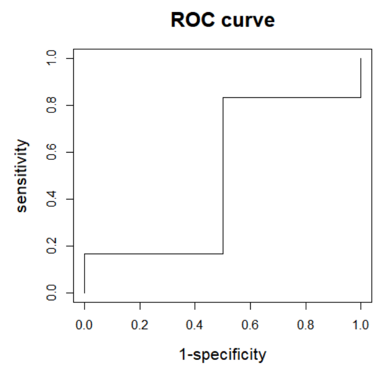

# 모델 성능 평가

### 회귀모델 평가 지표
- MSE
- RMSE
- MAE
- MAPE
- R^2

### 분류 모델 평가 지표
- 정확도(Accuracy)
- 재현율(Recall)
- 정밀도(Precision)
- F1 measure
- G measure
- ROC curve
- AUC

<br>

## Accuracy
- 실제 데이터와 예측 데이터가 얼마나 같은지 판단하는 지표
- $\frac{예측 결과가 동일한 데이터 건수}{전체 예측 데이터 건수} $
- 단점
    - 불균형한 데이터의 경우 특정한 결과로 예측할 때 정확도가 높게 나타날 수 있음
    - ex. 타이타닉 생존율 데이터는 여성 생존율이 많이 높음. 이 때 예측 모델을 여성이면 생존으로 만들었을 경우 맞춘 건수가 많기 때문에 무작정 정확도가 높게 나올 수 있음
```python
from sklearn.metrics import accuracy_score
```


## 오차행렬
||||예측(Predicted)|
|---|---|:---:|:---:|
|||0(Negative)|1(Positive)|
|정답|0(Negative)|TN|FP|
|(Actual)|1(Positive)|FN|TP|
※ positive: 적은 경우의 수인 것(ex. 양성, 스팸 메일)
```python
from sklearn.metrics import confusion_matrix
```

- 정확도(Accuracy)
$ \frac{TN+TP}{TN+FP+FN+TP}$
- 정밀도(Precision)
    - 양성 예측도
    - 예측 positive 중 일치한 데이터 비율
    - FP를 낮추고 TP를 늘리고자 함
    - $\frac{TP}{FP+TP}$
    ```python
    from sklearn.metrics import precision_score
    ```
- 재현율(Recall)
    - 민감도, TPR
    - 실제 positive 중 예측이 일치한 비율
    - FN은 낮추고 TP를 늘리고자 함
    - $\frac{TP}{FN+TP}$
    ```python
    from sklearn.metrics import recall_score
    ```
<br>
- 재현율과 정밀도는 서로 보완적인 지표(trade-off)
- 업무에 따라 정밀도/재현율 중요도가 다름
    - ex. 암진단 : 실제 positive인 데이터 예측을 negative로 잘못 판단하면 안됨 => 재현율이 더 중요
    - ex. 스팸메일 : 실제 negative인 데이터 예측을 positive로 하면 안됨 => 정밀도가 더 중요
- 그렇다고 한 지표만 매우 높고 한 지표만 매우 낮게 나오면 안 좋은거임
- 분류의 결정 임계값(Threshold)을 조정
- 

## F1 Score
- 정밀도와 재현율의 조화평균
- 정밀도와 재현율이 어느 한 쪽으로 치우치지 않는 수치를 나타낼 때 상대적으로 높은 값을 가짐
- $F1 = 2×\frac{Precision×Recall}{Precision+Recall}$
```python
from sklearn.metrics import f1_score
```

## G measure
- 정밀도와 재현율의 기하평균
- $G = \sqrt{Precisioin×Recall}$

## ROC curve
- 이진분류 모델의 예측 성능 평가지표
- 
- TPR : 재현율, 민감도(Sensitivity)
    - $\frac{TP}{TP+FP}$
- FPR : 1-특이도(Specificity)
    - 특이도
        - 실제 Negative인 데이터가 정확히 예측되는 수준
        - $\frac{TN}{TN+FP}$
    - $1-\frac{TN}{TN+FP}=\frac{FP}{TN+FP}$


## AUC
- ROC 곡선 아래 면적
- 
https://en.wikipedia.org/wiki/Partial_Area_Under_the_ROC_Curve

- 대각선의 직선에 대응되면 0.5
- 1에 가까울수록 좋음
```python
from sklearn.metrics import roc_auc_curve
```