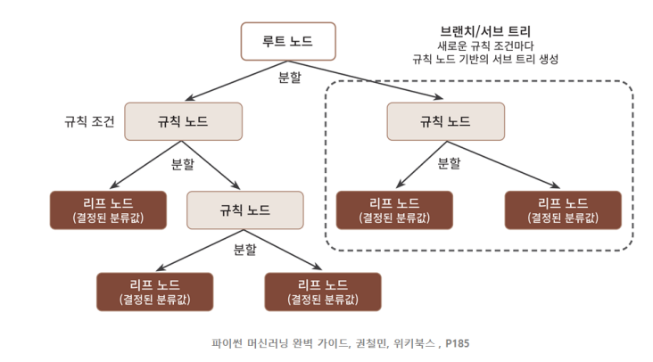

# 결정트리(Decision Tree)

## 구조

## 모델
- 분류 모형
    - 범주형 목표 변수를 기준으로 마디를 나눔
    - 끝마디에 포함된 자료의 범주가 분류 결과 값이 됨
- 회귀 모형
    - 연속형 목표 변수를 기준으로 마디를 나눔
    - 끝마디에 포함된 자료의 평균값이 각 끝마디의 회귀 값이 됨

## 주요 이슈
- 규칙이 많아지면 과대적합 발생
    - depth가 길어질수록 예측성능이 저하될 수 있음
- 가능한 적은 결정노드로 높은 예측 정확도를 가지려면 데이터를 분류할 때 최대한 많은 데이터 세트가 해당 분류에 속할 수 있도록 결정 노드의 규칙이 정해져야 함
- 최대한 균일한 데이터 세트를 구성할 수 있도록 분할하는 것이 중요

## 정지규칙
- max depth 제한
- leaf의 sample 수 제한
- split을 위한 sample 수 제한

## 가지치기
- 특정 노드 밑의 하부 트리를 제거해 일반화 성능을 높이는 방법
- 깊이가 줄어들고 결과의 개수가 줄어듦
- 과대적합을 막기 위한 방법

## 균일도(불순도:impurity)
- 정보균일도가 높은 데이터 세트를 먼저 선택할 수 있도록 규칙 조건을 만드는 것이 중요

- 측정지표
1. 엔트로피(Entropy)
    - 0 : 모든 값이 동일
    - 1 : 불순도 최대
    - $-\sum p_{i}log_{2}(p_{i})$
    - 좀 더 균형 잡힌 트리를 생성
2. 정보이득 지수
    - $1 - 엔트로피지수$
    - 결정트리는 정보이득지수가 높은 속성을 기준으로 분할
3. 지니계수
    - 0이 가장 평등
    - 1로 갈수록 불평등
    - 지니 계수가 낮은 속성을 기준으로 분할
    - $1 - \sum(p_{i})^2$
    - 가장 빈도 높은 클래스를 한쪽 가지로 고립시키는 경향이 있음

### 사이킷런의 결정트리 알고리즘 균일도 지표
- DecisionTreeClassifier : 'gini'
- DecisionTreeRegressor : 'mse'

## 결정 트리 알고리즘에서 분류를 결정하는 과정
1. 정보이득이 높거나 지니 계수가 낮은 조건을 찾아서
2. 자식 트리 노드에 걸쳐 반복적으로 분할한 뒤
3. 데이터가 모두 특정 분류에 속하게 되면 분할을 멈추고 분류 결정