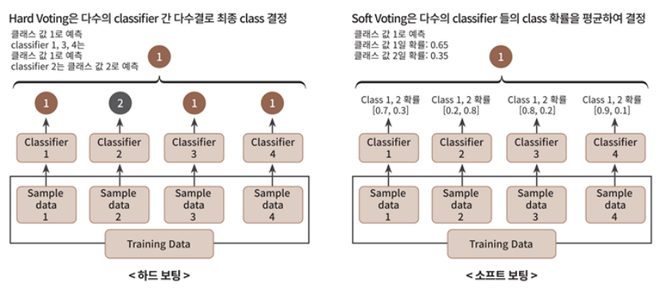
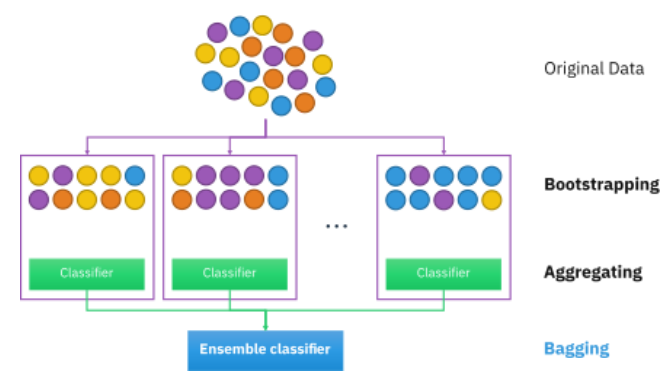
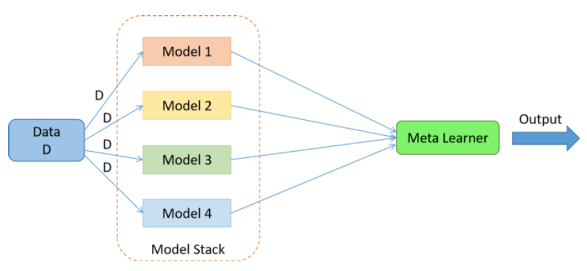

# 앙상블 학습
- 여러가지 예측기들을 결합하여 최적의 모델로 일반화

 

## 1. 보팅(Voting)
- 여러 예측기의 결과들을 투표를 통해 최종 예측결과로 결정하는 방식
- 일반적으로 **서로 다른 알고리즘을 가진 예측기**를 결합

- ① 하드 보팅
    - 예측한 결과값들 중 다수의 예측기가 결정한 예측값을 최종 보팅 결과값으로 선정
- ② 소프트 보팅
    - 예측기들의 예측값을 평균 내어 최종 예측값으로 결정
        - 분류의 경우 분류기들의 각 레이블 예측 확률의 평균으로 최종 분류 결정
    - 일반적으로 소프트 보팅이 예측 성능이 좋아서 더 많이 사용

출처: 파이썬 머신러닝 완벽 가이드

## 2. 배깅(Bagging)
- 샘플을 여러번 뽑아 각 모델을 학습시켜 결과물을 집계하는 방법
- 샘플링 : 부트스트랩 분할 방식
    - 각각 예측기별로 데이터를 샘플링하되 샘플링된 데이터 내에는 중복 데이터 허용
    - 복원 랜덤 샘플링
    * (교차 검증에서는 데이터 세트 간에 중첩 허용X)
- 보팅과 같은 방식으로 집계
    - 분류: 다수결 투표
    - 회귀: 평균값
- 과적합 방지에 효과적
- 대표적 배깅 방식 
    - 랜덤포레스트

https://en.wikipedia.org/wiki/Bootstrap_aggregating

## 3. 부스팅(Boosting)
- 여러 개의 예측기가 순차적으로 학습을 수행
- 이전 예측기의 예측이 틀린 데이터에 대해서 올바르게 예측할수 있도록 다음 예측기에 가중치를 부여하면서 학습과 예측을 진행
- 배깅에 비해 성능이 좋지만 속도가 느리고 과적합이 발생할 가능성이 존재하므로 상황에 따라 적절하게 사용해야 함
- 대표적 부스팅 알고리즘
    - AdaBoost
        - 관측치들에 가중치를 더하면서 동작
        - 분류하기 어려운 인스턴스에는 가중치를 더 주고 이미 잘 분류된 인스턴스에는 가중치를 덜 줌
        - weak learner로 결정트리 사용
    - GBM(Gradient Boosting Machine)
        - 앙상블 이전까지의 오차를 보정하도록 예측기를 순차적으로 추가
        - 반복마다 샘플의 가중치를 조정하는 대신 이전 예측기가 만든 잔여 오차에 새로운 예측기를 학습시킴
        - 경사하강법 기법을 사용
        - 예측성능이 높으나 과대적합이 빠르게 되고 시간이 오래 걸림
    - XGBoost
        - GBM의 단점을 보완한 모델
        - 과대적합 방지를 위한 규제를 둠
        - 균형트리분할 방식 사용
        - 트리의 균형을 잡기 위해 depth가 줄어들고 연산이 추가되는 것이 단점
    - LightGBM
        - 리프 중심 트리분할방식
        - 트리의 균형을 맞추지 않고 최대한 손실 값을 가지는 leaf 노드를 지속적으로 분할하면서 트리의 깊이가 깊어지고 비대칭적이 트리가 생성됨
        - 예측 오류 손실을 최소화할 수 있음
        - 학습시간이 적은 편이고 메모리 사용량이 상대적으로 적음
        - 카테고리형 피처들의 자동변환과 최적 분할 가능
        - 적은 데이터(10000건 이하 데이터) 사용시 과대적합 가능성 큼
 

** 배깅과 부스팅의 특징
- 부스팅은 배깅에 비해 error가 적으나 오래 걸림
- 배깅은 균일한 확률분포에 의해 training set 생성하지만 부스팅은 분류하기 어려운 training set 생성
- 배깅은 과대적합에 강하지만 부스팅은 높은 정확도를 갖으나 과대적합 가능성이 있음
- 배깅은 특정 영역에서 정확도가 낮고 부스팅은 이상치, 결측치에 취약함

## 4. 스태킹(Stacking)
- 교차검증(CV)으로 개별 모델이 예측한 데이터를 다시 메타 데이터세트로 사용하여 최종 모델 meta learner에서 학습하는 방식
- base learner에서 동일한 데이터 원본을 가지고 학습하게 되면 과적합 문제가 발생

https://www.analyticsvidhya.com/blog/2021/08/ensemble-stacking-for-machine-learning-and-deep-learning/

